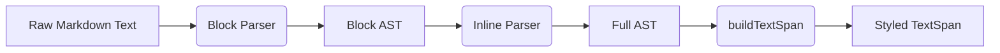
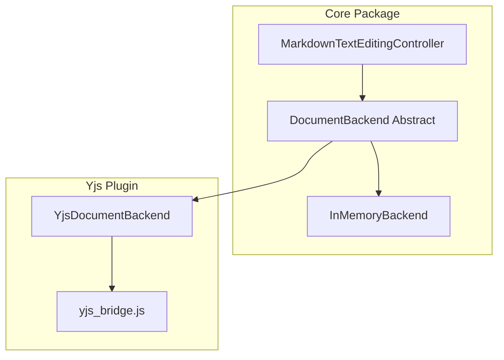

# Blazing Protostar

A high-performance, aesthetically pleasing Markdown Editor for Flutter. Built with real-time collaboration in mind.

[](https://flutter.dev)
[](LICENSE)

## Key Features

1.  **Direct Markdown Editing** ✅
    -   Users edit Markdown text directly.
    -   Control characters (e.g., `**`, `#`) are visible but styled in a low-contrast color.
    -   **Live Styling**: Text is styled in real-time (e.g., bold text appears bold).

2.  **Generic Directives Support** ✅
    -   Full support for `:name[content](args){attributes}` syntax.
    -   **Custom Rendering**: Developers can map directives to arbitrary Flutter widgets.
    -   **Default Fallback**: Unhandled directives render as raw text (opt-in behavior).
    -   *Details*: See [Directives Usage](docs/directives.md).

3.  **Markdown Toolbar** ✅
    -   Standard CommonMark operations (Bold, Italic, Header, List, Link).
    -   Actions insert appropriate control characters into the text stream.
    -   **Reactive Highlighting**: Buttons highlight based on cursor position.
    -   **Configurable Positioning**: Can be placed as a header (Top) or footer (Bottom).

4.  **Collaborative Editing (Optional)** ✅
    -   Real-time collaboration via **Y.js** CRDT.
    -   **Block-Aware Sync**: Robust conflict resolution for concurrent edits.
    -   **Cross-Tab Sync**: Edits sync across browser tabs via `BroadcastChannel`.
    -   *Details*: See [crdt.md](docs/crdt.md) for technical requirements.

5.  **WYSIWYG Toggle** 🚧
    -   A toggleable mode that hides control characters while preserving styling.
    -   Allows users to see the rendered output without distraction ("Zen Mode").

6.  **Read-Only Mode** 🚧
    -   Disables editing capabilities.
    -   Useful for previews or displaying static content.

7.  **Full Theme Customization** 🚧
    -   Control all visual aspects (colors, text styles, syntax opacity) via a theme object.
    -   *Rationale*: Ensures the editor can adapt to any design system.

## 📦 Project Structure

This is a monorepo containing the following packages:

| Package                                                       | Description                                    |
| :------------------------------------------------------------ | :--------------------------------------------- |
| **[blazing_protostar](packages/blazing_protostar)**           | Core editor widget, lexer, and controller.     |
| **[blazing_protostar_yjs](packages/blazing_protostar_yjs)**   | Yjs collaboration plugin with JS bridge.       |

## 🚀 Getting Started

### Prerequisites

-   Flutter SDK (stable channel)
-   A web browser for development (Chrome recommended)

### Running the Example

```bash
# Navigate to the example app
cd packages/blazing_protostar_yjs/example

# Run on Chrome
flutter run -d chrome
```

### Using in Your Project

Add the core package to your `pubspec.yaml`:

```yaml
dependencies:
  blazing_protostar:
    path: ../packages/blazing_protostar # Or use a git dependency
```

For collaboration features, also add the Yjs plugin:

```yaml
dependencies:
  blazing_protostar_yjs:
    path: ../packages/blazing_protostar_yjs
```

## 🏛️ Architecture

The editor is built around a custom `TextEditingController` that uses a two-phase parsing strategy:



For collaboration, an abstract `DocumentBackend` allows the editor to function standalone or connect to a CRDT provider:



## 📚 Documentation

Detailed specifications are in the `docs/` directory:

-   [Implementation Plan](docs/implementation_plan.md) - Phase checklist and progress.
-   [Core Editor Spec](docs/v001_core_editor.md) - v1 requirements.
-   [Toolbar Spec](docs/v002_toolbar.md) - v2 requirements.
-   [WYSIWYG Spec](docs/v003_wysiwyg.md) - v3 requirements.
-   [Lexer Architecture](docs/lexer.md) - Parser design.
-   [CRDT & Collaboration](docs/crdt.md) - Yjs integration details.
-   [Toolbar Customization](docs/toolbar.md) - How to customize the toolbar.
-   [Directives Usage](docs/directives.md) - Custom widget guide.

## 🧪 Testing

```bash
# Run core package tests
cd packages/blazing_protostar
flutter test

# Run Yjs package tests
cd packages/blazing_protostar_yjs
flutter test
```

## 📄 License

This project is licensed under the MIT License - see the [LICENSE](LICENSE) file for details.
