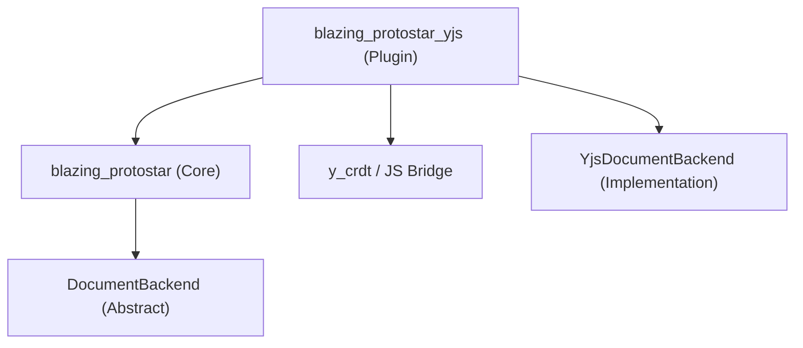

# CRDT & Y.js Integration Requirements

## Topic: Enabling Collaborative Editing via Y.js Bindings

This document tracks the requirements and implementation phases for adding CRDT support (specifically Y.js) to the Flutter Markdown Editor.

---

## Technical Discussion & Decisions

### [Question 1: Target Y.js Implementation]
- **Status**: Decided (JavaScript Bridge)
- **Decision**: **JavaScript Bridge**.
    - **Web**: Use `dart:js_interop` to interface with the official Yjs library.
    - **Mobile/Desktop**: Use an embedded JS engine (e.g., `flutter_js`) to run the Yjs logic. This ensures a single source of truth for CRDT math while avoiding the memory management issues of the current `y_crdt` WASM package.

### [Question 2: Sync Granularity & Structure]
- **Status**: Decided (Phase 1: Flat Text)
- **Question**: Should the CRDT sync the raw Markdown source string or a structured semantic representation?
- **Decision**: **Flat Text (Phase 1)**.
    - We will use a single `Y.Text` (rope) to represent the entire document.
    - **Rationale**: This is the standard approach for rich text editors (ProseMirror, Quill, Monaco) binding to Yjs. It performs efficiently ($O(\log N)$) even for large documents and avoids the complexity of dual-tree synchronization for the MVP.
    - **Future**: A structured tree approach remains an option for Phase 2 optimizations but is not required for correctness.

### [Question 3: Remote Presence & Awareness]
- **Status**: Decided
- **Question**: How should remote user presence (cursors and selections) be rendered given that markdown syntax is visible?
- **Decision**: 
    - **Cursor**: Free movement (can be inside syntax markers).
    - **Selection**: Highlights cover syntax markers as well.
    - **Styling**: Colored vertical bars for cursors; light colored backgrounds for selections.

### [Question 4: Delta API / State Architecture]
- **Status**: Decided (Block-Aware Controller, Flat Backend)
- **Question**: Given the **Flat Text** sync model, how should the internal state be managed?
- **Decision**: **Hybrid Approach**.
    - **Backend**: The Yjs backend syncs a flat string (`Y.Text`).
    - **Controller**: The `MarkdownTextEditingController` maintains a local list of `BlockState` objects for rendering and logic, but applies changes to the flat backend string. Re-parsing is fast enough for the client.

### [Question 5: Markdown-to-Y.js Mapping]
- **Status**: Decided (Flat Mapping)
- **Question**: How do we sync Markdown syntax (like `> ` or `- `) with CRDT block types?
- **Decision**: **Text-as-Canonical-Source**. 
    - The RAW string content in a `Y.Text` object is the source of truth. 
    - The `blazing_protostar_yjs` backend is now given a specific `Y.Text` instance directly. 
    - This allows it to work with documents of any structure, whether the markdown is at the root or nested within a larger document.

### [Question 6: Undo/Redo Strategy]
- **Status**: Decided
- **Question**: Y.js provides its own `UndoManager` which is CRDT-aware. Flutter's `TextField` also has built-in undo/redo. How should we handle this?
- **Decision**: **Intercept and Override**. We will disable Flutter's native undo/redo stack and map keyboard shortcuts (Cmd+Z / Cmd+Shift+Z) to the Y.js `UndoManager`.

### [Question 7: Inline Style Representation]
- **Status**: Decided (Option 1: Raw Sync)
- **Question**: Within a `Y.Text` block, should we use Y.js formatting attributes or rely solely on character sync?
- **Decision**: **Option 1: Raw Sync Only**.
    - **Rationale**: Since our editor keeps markdown syntax (e.g., `**`) visible and the Lexer uses these markers as the source of truth for styling, adding Y.js formatting attributes would create a "Dual Truth" problem. If the CRDT attributes and the text markers desync, the UI would become unpredictable.
    - **Risk Mitigation**: "Syntax shredding" (where concurrent edits break a marker pair) will be handled by the user re-typing the marker, or by future refinement of the diffing algorithm.

- **Undo/Redo**: Intercept and Override. Map Cmd+Z to Y.js UndoManager.
- **Package Architecture**: **Sidecar Package**. The core `blazing_protostar` package will NOT depend on Y.js. We will create a `blazing_protostar_yjs` package that provides the `YjsDocumentBackend`.

## Project Structure

---

---

## Implementation Phases

### Phase 1: Controller Refactor (Block-Awareness)
- **Goal**: Transition from a single string source to a block-list-backed controller.
- **Acceptance Criteria**: 
    - [ ] `MarkdownTextEditingController` manages an internal list of `MarkdownBlock` objects.
    - [ ] The `text` property is dynamically computed from these blocks.
    - [ ] Selection and Cursor logic correctly maps from flat indices to block + local-offset.
    - [ ] Unit tests verify that normal typing/editing behaves identically to the current flat implementation.

### Phase 2: Bridge Architecture (Optionality)
- **Goal**: Introduce the `DocumentBackend` abstraction.
- **Acceptance Criteria**:
    - [ ] Define `abstract class DocumentBackend` with methods for `insert`, `delete`, `updateType`.
    - [ ] Implement `InMemoryDocumentBackend` (default).
    - [ ] Refactor formatting actions (`applyFormat`) to use the backend instead of direct string manipulation.

### Phase 3: Sidecar Research & Setup
- **Goal**: Establish the `blazing_protostar_yjs` package and prototype the JS Bridge.
- **Tasks**:
    - [x] Restructure project into `packages/` monorepo.
    - [x] Create `blazing_protostar_yjs` package stub.
    - [ ] Prototype `YjsDocumentBackend` interfacing with a JS engine.
- **Acceptance Criteria**:
    - [ ] `blazing_protostar_yjs` successfully depends on the core pkg.
    - [ ] A basic string can be synced via a JS-backed CRDT node in a test environment.

### Phase 4: Presence & Presence UI
- **Goal**: Synchronize cursors and render them.
- **Acceptance Criteria**:
    - [ ] `Y.Awareness` state is integrated into the backend.
    - [ ] `MarkdownEditor` renders custom painters for remote cursors and selections.
    - [ ] User identifications (colors/names) appear correctly.

### Phase 5: Undo/Redo & Polish
- **Goal**: Hook into Y.js UndoManager and refine performance.
- **Acceptance Criteria**:
    - [ ] `ShortcutManager` intercepts Cmd+Z and routes to `backend.undo()`.
    - [ ] Performance testing on 100+ blocks in a collaborative session.

### Phase 6: Validation & Fuzzing (Conformance)
- **Goal**: Ensure the editor binding is robust against race conditions and concurrent edits.
- **Reference (JS Ecosystem)**:
    - **y-test**: Uses a virtual network to delay/reorder messages.
    - **Roundtrip Invariant**: Local -> Remote -> Local must be idempotent.
    - **Fuzzing**: 1000+ random ops on two instances until convergence.
- **Acceptance Criteria**:
    - [ ] **Convergence Fuzzer**: A test that runs 1000+ random operations on two instances and verifies the final state matches after sync.
    - [ ] **Cursor Stability**: Verify remote edits don't cause local cursor jumps or focus loss.
    - [ ] **Syntax Shredding Resilience**: Verify that conflicting edits to Markdown markers (e.g., `**`) don't crash the parser.
